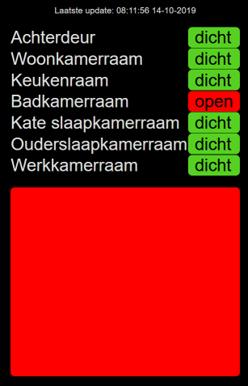

# FibaroHomeStatus

CherryPy webserver that retrieves the status from my [https://www.fibaro.com/en/products/home-center-2/](Fibaro Home Center 2) and shows it in a form suitable for a small wall-mounted display. 

I have placed a number of door and window sensors around the house and put the display next to the front door. That way I can always see which door or window is still open right before I leave.

## Usage

The Docker image can be found on the Docker hub. To use it, use a command line like:

    docker run -d -p 8080:80 -e FIBARO_USER_NAME=myusername -e FIBARO_PASSWORD=mypassword -e FIBARO_HOST=192.168.2.3 blauwelucht/fibarohomestatus

Then point a browser to the machine where you're running Docker. In my case I have an old Android tablet with a [https://www.wikihow.com/Set-a-Bookmark-Shortcut-in-Your-Home-Screen-on-Android](shortcut to the site).

## Known issues

- When the connection to HC2 is temporarily unavailable, you will get an ugly Python error. Also you need to reload the page after the connection is restored.
- It would be really nice if it would show when a sensor needs it's battery replaced/recharged.
- The configuration is completely specific for my home. Using a data file that can be read from a volume would be much cleaner.